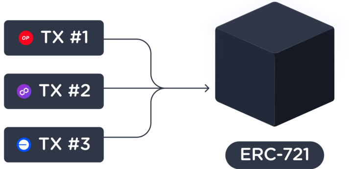

<p align="center">
   <br>
     <a href="https://layer3.xyz" target="_blank">
      
     </a>
   <br>
   <br>
</p>

[](https://twitter.com/layer3xyz)
[](https://discordapp.com/layer3)
[](https://github.com/layer3xyz/cube-contracts/blob/main/LICENSE)

```
   ________  ______  ______
  / ____/ / / / __ )/ ____/
 / /   / / / / __  / __/
/ /___/ /_/ / /_/ / /___
\____/\____/_____/_____/
```

# Introduction

CUBEs, or Credentials to Unify Blockchain Events, are ERC-721 credentials that attest and unify multi-chain, multi-transaction, and multi-dapp quests onchain. As new ecosystems appear everyday, a simple way of querying impact and distributing rewards is necessary. CUBE lays the foundation for rewards in a world of 1,000,000 chains.

<p align="center">
   <br>
   <br>
     <a href="https://layer3.xyz" target="_blank">
      
     </a>
   <br>
   <br>
</p>

## Install

```bash
make install
make build
```

### Deployment

```bash
make deploy_proxy ARGS="--network base_sepolia"
```

### Test

```bash
make test
```

## Overview

Upon completing certain quests, users have the opportunity to mint a CUBE. This unique NFT encapsulates data from the quest, serving as a digital record of achievement. Check out an example of a minted CUBE on [Opensea](https://opensea.io/assets/base/0x1195cf65f83b3a5768f3c496d3a05ad6412c64b7/95).

### Minting Process

The minting process is initiated by a wallet with the _signer role_ creating an EIP-712 signature. This signature encapsulates all requisite data for the `mintCubes` function, ensuring the integrity and accuracy of the minting process. The user then broadcasts the transaction, including this signature and data. Minting transactions emit events in the smart contract that are captured onchain.

### Quest Initialization

When a new quest comes to life in our system, we call `initializeQuest`. This function is key—it broadcasts event data about the quest, such as participating communities (Layer3, Uniswap, 1Inch, etc.), the quest's difficulty level (beginner, intermediate, advanced), title, and more.

## CUBE Smart Contract Details

#### Key Features

- EIP712 Signatures: Utilizes EIP712 to sign data.
- Analytics: Events emitted by the contract are captured for analytics.
- Referral System: Incorporates a referral mechanism in the minting process.

#### Deployment Details

- Contract Name: CUBE
- Compiler Version: 0.8.20
- Optimizations: Yes, 10,000 runs.

#### Roles and Permissions

- Default Admin: Full control over the contract and can handle the different roles.
- Signer: Authorized to initialize quests and sign cube data for minting.
- Upgrader: Can upgrade the contract

## Token Reward System

### Overview

The Layer3 Token Reward System automates the distribution of token rewards upon the completion of onchain events. This system is empowered by two primary smart contracts, [Factory.sol](./src/escrow/Factory.sol) and [Escrow.sol](./src/escrow/Escrow.sol), which work in tandem with [CUBE.sol](./src/CUBE.sol) to handle the lifecycle of reward distribution. Used with CUBEs, this is the first mechanism that supports token rewards for multichain interactions.

### Contracts

### Factory

[Factory.sol](./src/escrow/Factory.sol) serves as a factory hub within the Layer3 Token Reward System, and is responsible of creating individual [Escrow.sol](./src/escrow/Escrow.sol) contracts for each new quest. These escrow contracts are where the token rewards are stored and from which they are distributed to the users upon quest completion.

#### Key Functions

- **createEscrow**: Deploys a new [Escrow.sol](./src/escrow/Escrow.sol) instance with specified admin and whitelisted tokens for a given quest ID.
- **updateEscrowAdmin**: Allows changing the admin of an escrow.
- **withdrawFunds**: Withdraws funds from the escrow when a quest is inactive, supporting various token types.
- **distributeRewards**: Sends out rewards from escrow when called by the CUBE contract.

### Escrow

[Escrow.sol](./src/escrow/Escrow.sol) acts as a holding mechanism for tokens until they are rewarded to users upon quest completion. It is designed to support various token standards including ERC20, ERC721, and ERC1155.

#### Key Functions

- **addTokenToWhitelist**: Enables a token to be used within the escrow.
- **removeTokenFromWhitelist**: Disables the use of a token within the escrow.
- **withdrawERC20**, **withdrawERC721**, **withdrawERC1155**, **withdrawNative**: Allow the withdrawal of rewards to a specified recipient, applying a rake as defined.

### Workflow

1. **Quest Initiation**: When creating a new quest that should contain a token reward, the creator additionally creates a unique [Escrow.sol](./src/escrow/Escrow.sol) for the quest by calling [Factory.sol](./src/escrow/Factory.sol).
2. **Reward Funding**: The created [Escrow.sol](./src/escrow/Escrow.sol) contract is then funded with the appropriate tokens that will be awarded to the users completing the quest.
3. **Quest Completion**: After users complete the quest and mint their CUBEs, the [CUBE.sol](./src/CUBE.sol) contract calls the **distributeRewards** function inside [Factory.sol](./src/escrow/Factory.sol), which triggers [Escrow.sol](./src/escrow/Escrow.sol) to make a push payment to the user.

---

### Audits

In December 2023 [CUBE.sol](./src/CUBE.sol) was audited by Sherlock. Find the report [here](./audit/cube/sherlock_december_2023.pdf).

In March 2024, both [Factory.sol](./src/escrow/Factory.sol) and [Escrow.sol](./src/escrow/Escrow.sol) were audited by Three Sigma. Find the report [here](./audit/escrow/three_sigma_march_2024.pdf).

### Bug Bounty Program

| Severity Level | Description                                                                                                                    | Examples                                                                                                 | Maximum Bounty |
| -------------- | ------------------------------------------------------------------------------------------------------------------------------ | -------------------------------------------------------------------------------------------------------- | -------------- |
| **Critical**   | Bugs that could lead to substantial theft or loss of tokens, or severe damage to the protocol's integrity.                     | Exploits allowing unauthorized token transfers or contract manipulations.                                | Contact Us     |
| **High**       | Issues that can affect the functionality of the CUBEs contracts but don't directly lead to a loss of funds.                    | Temporary inability to claim or transfer CUBEs, manipulation of non-critical contract states.            | Up to 5 ETH    |
| **Medium**     | Bugs that cause inconvenience or unexpected behavior, but with limited impact on the overall security and functionality.       | Contracts using excessive gas, causing inefficiency or denial of service without direct economic damage. | Up to 2.5 ETH  |
| **Low**        | Non-critical issues that relate to best practices, code optimization, or failings that have a minor impact on user experience. | Sub-optimal contract performance, failure to meet standards or best practices without economic risk.     | Up to 0.5 ETH  |

_Note: All bounties are at the discretion of the Layer3 team and will be awarded based on the severity, impact, and quality of the report. To claim a bounty, a detailed report including proof of concept is required. For submissions or inquiries, please email us at [security@layer3.xyz](mailto:security@layer3.xyz)._

---

### License

This repo is released under the Apache 2 license, see [LICENSE](./LICENSE) for more details. However, some files are licensed under MIT, such as the test and script files.
